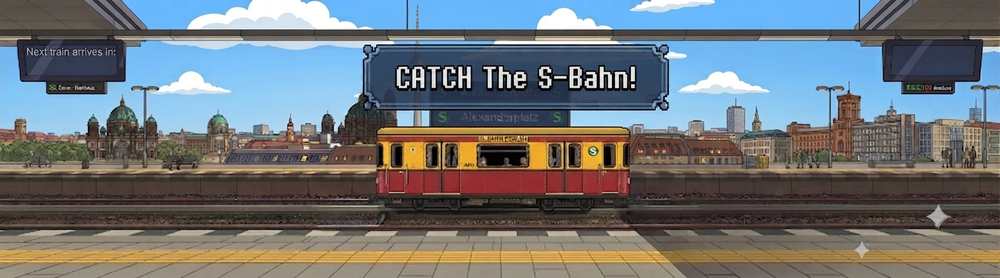

# Catch the S-Bahn! 🚆

## Overview

**Catch the S-Bahn!** is a simple reaction-based game built with **Python** and **Pygame**. The objective is to board as many S-Bahn trains as possible by pressing the **Spacebar** while the train is stopped with its doors open.

Each successful catch increases your score and makes the game progressively more difficult by reducing the amount of time the train remains at the station.

---

## Features

* Random train arrival times.
* Increasing difficulty after every successful catch.
* Countdown timer showing the next train's arrival.
* Score counter displaying the number of trains caught.
* Simple animated jump when the player boards a train.
* Game over if a train leaves without being boarded.

---

## How the Game Works

### Train Arrival

* At the beginning of each round, the train waits for a random amount of time (between **1 and 8 seconds**) before arriving.
* A countdown timer on the station sign displays the remaining time until the train arrives.

### Boarding

* Once the train reaches the platform, it stops and opens its doors.
* Press the **Spacebar** while the doors are open to successfully board the train.
* The player performs a small jump animation to indicate a successful boarding.

### Difficulty

Each successful boarding:

* Increases your score by **1**.
* Reduces the amount of time the train waits at the station before departing.

Initially, the train waits for approximately **2 seconds** (60 frames at 30 FPS). After each successful catch, the waiting time decreases by **5 frames**, down to a minimum of **20 frames**, making the game increasingly challenging.

### Game Over

If the player fails to board the train before it leaves the screen, the game ends and displays the total number of trains caught.

---

## Controls

| Key              | Action                                  |
| ---------------- | --------------------------------------- |
| **Spacebar**     | Board the train when its doors are open |
| **Close Window** | Exit the game                           |

---

## Project Structure

```
project/
│
├── main.py               # Main game source code
├── background2.png       # Station background
├── human.png             # Player sprite
├── sbahn.png             # Train with closed doors
├── sbahn_open.png        # Train with open doors
└── README.md             # Documentation
```

---

## Classes

### Player

Responsible for:

* Player jump animation.
* Drawing the player sprite.

### Timer

A reusable countdown timer used to:

* Control train arrival timing.
* Display the countdown until the next train.

### Train

Responsible for:

* Random arrival timing.
* Moving toward the station.
* Opening and closing doors.
* Leaving the station.
* Detecting whether the player can board.

### ScoreKeeper

Tracks:

* Number of trains successfully caught.
* Whether the game has ended.

### GameManager

Controls the overall game by:

* Processing user input.
* Updating all game objects.
* Rendering graphics.
* Displaying the HUD.
* Detecting game-over conditions.

---

## Requirements

* Python 3.x
* Pygame

Install Pygame using:

```bash
pip install pygame
```

---

## Running the Game

Run the program with:

```bash
python main.py
```

---

## Gameplay Summary

1. Wait for the countdown.
2. The train arrives at the platform.
3. When the train stops and the doors open, press **Spacebar**.
4. Successfully board to earn a point.
5. The next train arrives faster.
6. Miss a train and the game ends.

Good luck, and see how many S-Bahn trains you can catch!
